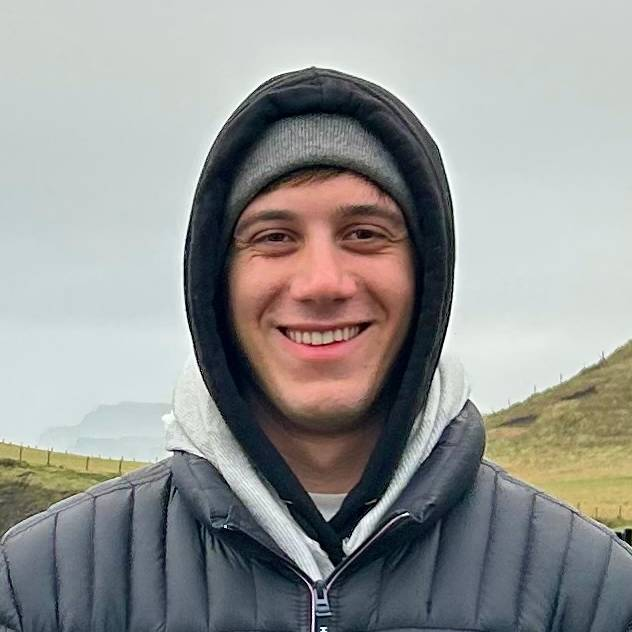
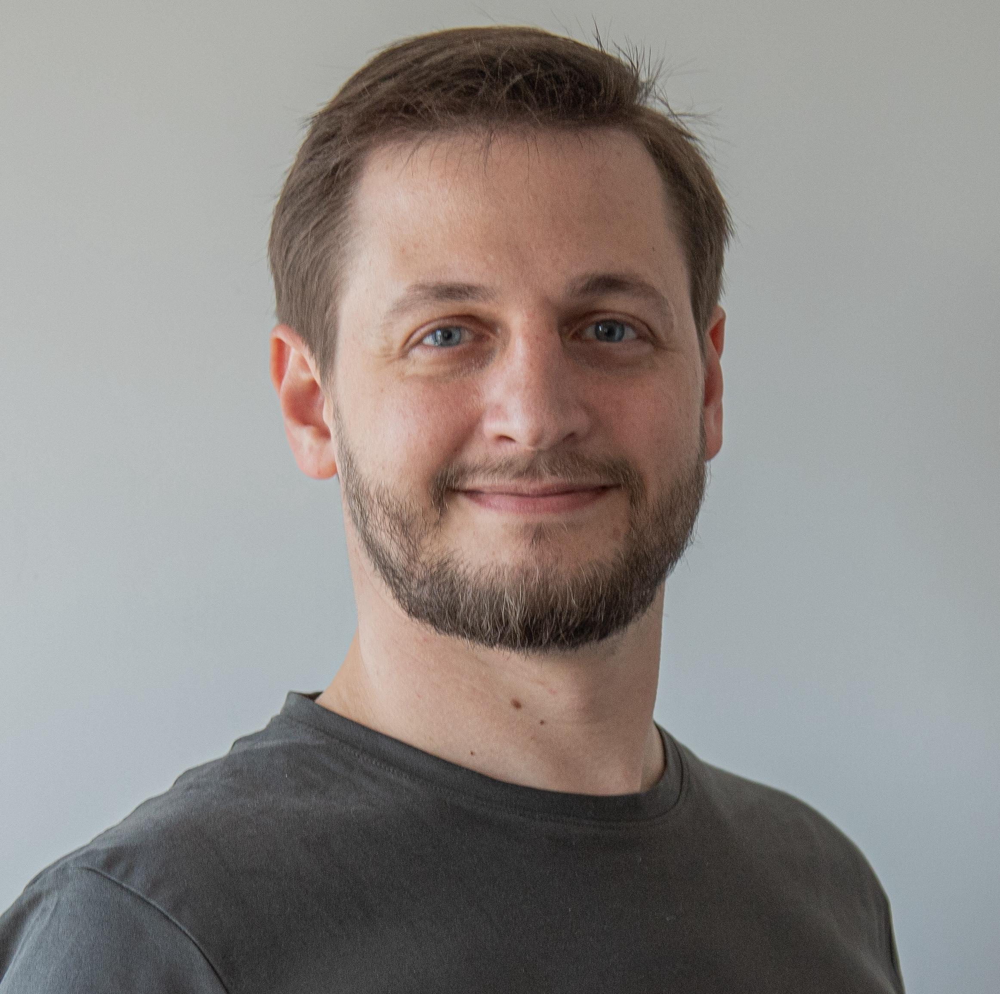

# ¿Quiénes somos?

::left::

**Juan Seveso**

- Full-Stack Developer en [AnagramDev](https://www.anagram.dev)
- Estudiante de Ing. en Computación

 

<logos-github-icon style="background: white; border-radius: 20px" /> [https://github.com/juanseveso](https://github.com/juanseveso)

 

<logos-linkedin-icon /> [https://linkedin.com/in/juanseveso](https://linkedin.com/in/juanseveso)

 

::right::

**Joaquín Gatica**

- CTO y Co-Founder en [AnagramDev](https://www.anagram.dev)
- Technical Architect

 

<logos-github-icon style="background: white; border-radius: 20px" /> [https://github.com/joaquingatica](https://github.com/joaquingatica)

 

<logos-linkedin-icon /> [https://linkedin.com/in/joaquingatica](https://linkedin.com/in/joaquingatica)

 

---
layout: cover
---

# Agenda

1. Tema 1
2. Tema 2
3. ...
